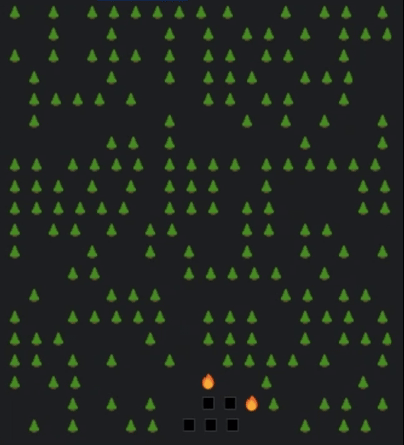
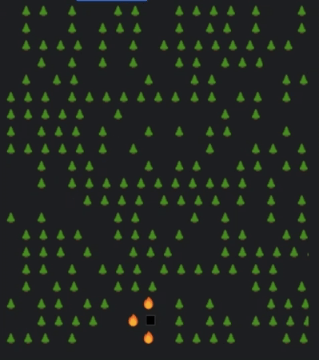
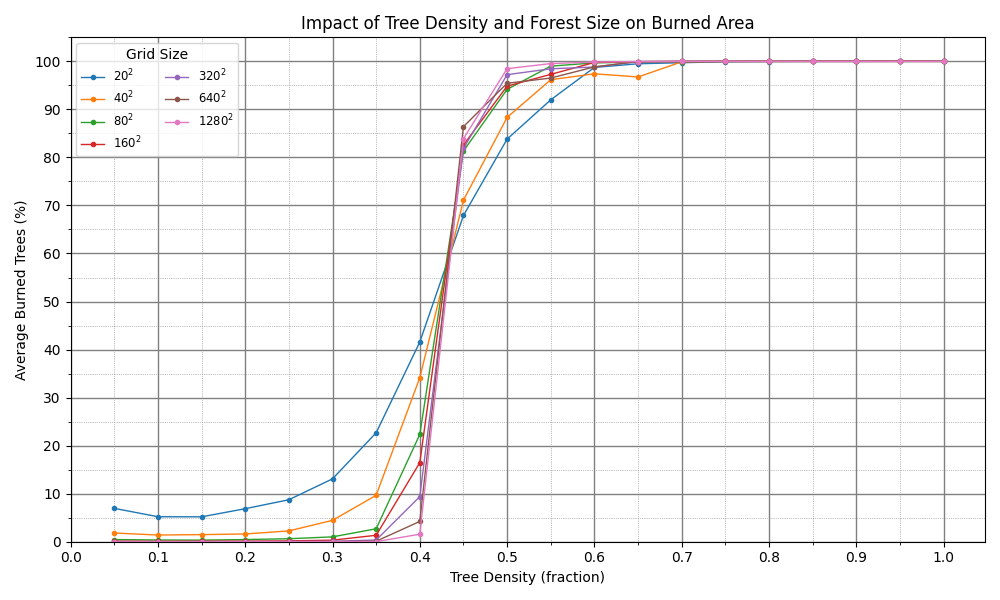
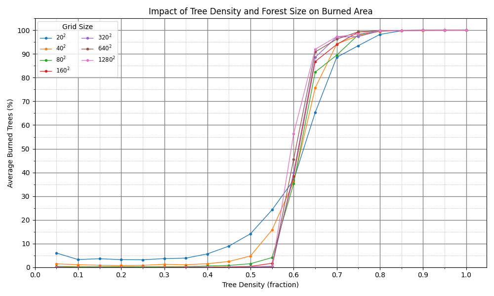

# Forest Fire Simulation 🔥🌲

A Rust-based forest fire spread simulator that models fire propagation in a procedurally generated forest grid. 
After a lightning strike ignites a random tree, fire spreads according to a configurable neighborhood strategy, 
and the simulation reports statistics on burned area across multiple runs.

<table>
  <tr>
    <td></td>
    <td></td>
  </tr>
  <tr>
    <td align="center"><em>Example simulation with Moore neighborhood</em></td>
    <td align="center"><em>Example simulation with Von Neumann neighborhood</em></td>
  </tr>
</table>


## Features
- **Grid-based forest model** with customizable dimensions
- **Procedural generation** with adjustable tree density
- **Fire spread algorithms**:
    - Moore neighborhood (8-directional)
    - Von Neumann neighborhood (4-directional)
- **Multi-simulation analysis** with min/max/avg burn statistics
- **Real-time CLI visualization** with adjustable frame rate
- **Headless mode** for batch processing and data collection
- **Statistical output** of burned area percentages
- **Modular architecture** easy extensibility following *SOLID* principles


## Project Overview

This project implements a forest fire model on a two-dimensional grid, where each cell may be empty, contain a tree, be burning, or be burned. Trees are randomly placed based on a user-defined density, and a random tree is ignited to simulate a lightning strike. Fire spreads each timestep according to the selected neighborhood (Moore for 8-directional or Von Neumann for 4-directional). Statistics such as minimum, maximum, and average burned percentages are computed over multiple runs.

## File Structure

```
src/
├── config.rs        # Command-line argument parsing and configuration struct
├── forest.rs        # Forest grid, cell states, ignition and spread core logic
├── fire_spread.rs   # FireSpreadStrategy trait and neighborhood implementations
├── simulation.rs    # Running multiple simulations and aggregating results
├── display.rs       # CLI visualization engine using crossterm
├── main.rs          # Entrypoint: load config, execute simulations, print results
└── lib.rs           # Re-exports modules and test harness
```

* **config.rs**: Defines a `Config` struct capturing parameters (`size`, `density`, `simulations`, `burn_pattern`, `graphics`, `frame_delay_ms`, `quiet`) and implements parsing from `std::env::args()` with validation.
* **forest.rs**: Implements the `Forest` struct holding the grid (`Vec<Vec<CellState>>`), methods to randomly populate trees, ignite a cell, spread fire per timestep, and compute burn statistics.
* **fire\_spread.rs**: Declares the `FireSpreadStrategy` trait with implementations for `MooreNeighborhood` (8-directional spread) and `VonNeumannNeighborhood` (4-directional spread), plus boundary helpers.
* **simulation.rs**: Contains `run_simulations(config: &Config) -> SimulationResults`, iterating over the configured number of runs, invoking `Forest` creation and spread, and aggregating min/max/average burned percentages.
* **display.rs**: Provides `ForestDisplay` using the `crossterm` crate for animated CLI rendering when `graphics` enabled.
* **main.rs**: Loads `Config`, calls `run_simulations`, and prints formatted results or raw average if `quiet` flag.
* **tests**: Unit tests in each module verifying config parsing, neighborhood correctness, forest initialization, and simulation outputs.

## Installation

1. **Clone the repository**

   ```bash
   git clone https://github.com/radoslawwolnik/project-forest-fire.git
   cd project-forest-fire
   ```

2. **Build the project**

   ```bash
   cargo build --release
   ```

3. **Run executable**

   ```bash
   ./target/release/forest_fire_sim [OPTIONS]
   ```

## Usage

```text
USAGE:
    forest_fire_sim [OPTIONS]

OPTIONS:
    -s, --size <size>              Grid dimensions (width=height). Default: 20
    -d, --density <density>        Tree density [0.0–1.0]. Default: 0.6
    -c, --simulations <count>      Number of runs. Default: 1
    -b, --burn-pattern <pattern>   'moore' (8-dir) or 'vonneumann' (4-dir). Default: moore
    -g-off, --graphics-off         Disable CLI animation. Default: graphics on
    -fd, --frame-delay <ms>        Frame delay in ms when animating. Default: 50
    -q, --quiet                    Print only average burned (raw float)
    -h, --help                     Show this help message
```

### Examples

* **Single run with default settings**

  ```bash
  cargo run --release
  ```

* **100×100 grid at 70% density, 50 runs, no graphics**

  ```bash
  cargo run -- --size 100 --density 0.7 --simulations 50 --graphics-off
  ```

* **50 runs, Von Neumann spread, 100 ms delay**

  ```bash
  cargo run -- -c 50 -b vonneumann -fd 100
  ```

## Simulation Diagrams

Below are sample outputs from multiple simulations, plotting tree density versus burned percentage. 

Moore:
- Above 60% density all trees will get burned
- Biggest change between 35% to 55%
- Critical threshold at ~40% density where burn percentage sharply increases

*Density vs Burn Percentage Moore*

Von Neumann:
- Above 80% density all trees will get burned
- Biggest change between 50% to 70%
- Critical threshold at ~55% density where burn percentage sharply increases

*Density vs Burn Percentage Von Neumann*


## Technical Implementation
### Grid Representation
```rust
enum CellState { Empty, Tree, Burning, Burned }
```
- 2D grid stored as nested `Vec<CellState>`
- Initialized using Fisher-Yates shuffling for precise tree counts

### Fire Propagation
1. Random tree ignition via lightning strike
2. Iterative spread to adjacent cells:
    - Moore: All 8 surrounding cells
    - Von Neumann: Cardinal directions only
3. Simulation terminates when firefront extinguishes

### Performance
- Single-threaded processing of 100x100 grid: ~15ms/trial
- Memory efficient: ~100KB per 100x100 grid
- Batch mode processes 10k trials/min (2.5GHz CPU)

## Optimization Highlights
- **O(1) tree counting**: Maintains exact tree count during generation
- **Firefront queue**: Processes only burning cells each iteration
- **Reservoir sampling**: Efficient random tree selection for ignition
- **Terminal optimizations**: Double-buffered rendering with crossterm

## Testing

Run `cargo test` to verify:

* Config parsing and validation
* Neighborhood algorithms (Moore & VonNeumann)
* Forest initialization and burn spread logic
* Simulation aggregate behavior

## License

MIT
```
MIT License

Copyright (c) 2025 Radoslaw

Permission is hereby granted, free of charge, to any person obtaining a copy
of this software and associated documentation files (the "Software"), to deal
in the Software without restriction, including without limitation the rights
to use, copy, modify, merge, publish, distribute, sublicense, and/or sell
copies of the Software, and to permit persons to whom the Software is
furnished to do so, subject to the following conditions:

The above copyright notice and this permission notice shall be included in all
copies or substantial portions of the Software.

THE SOFTWARE IS PROVIDED "AS IS", WITHOUT WARRANTY OF ANY KIND, EXPRESS OR
IMPLIED, INCLUDING BUT NOT LIMITED TO THE WARRANTIES OF MERCHANTABILITY,
FITNESS FOR A PARTICULAR PURPOSE AND NONINFRINGEMENT. IN NO EVENT SHALL THE
AUTHORS OR COPYRIGHT HOLDERS BE LIABLE FOR ANY CLAIM, DAMAGES OR OTHER
LIABILITY, WHETHER IN AN ACTION OF CONTRACT, TORT OR OTHERWISE, ARISING FROM,
OUT OF OR IN CONNECTION WITH THE SOFTWARE OR THE USE OR OTHER DEALINGS IN THE
SOFTWARE.
```